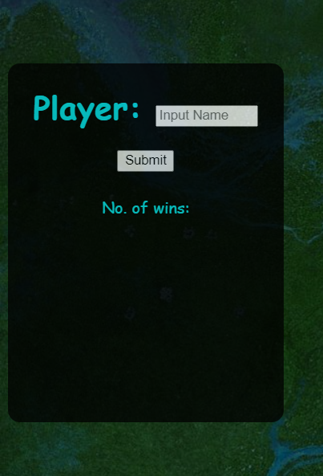
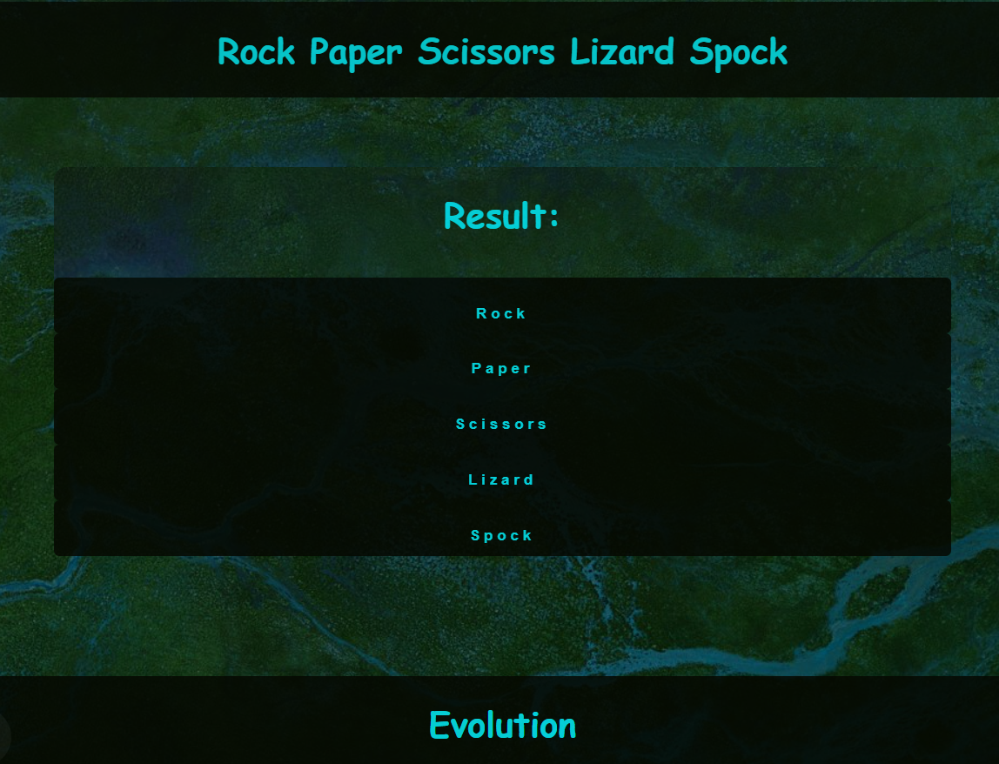
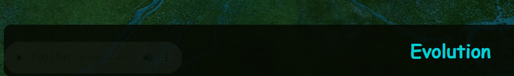

# Rock Paper Spock

This site has been designed to target a younger audience during those in-between study times when they need to burn off some steam. It is a variant of the popular Rock-Paper-Scissors game with a twist that youngsters of all ages can enjoy. 

The user faces off against the maschine in this game of chance, and everything is simple and easy to navigate and understand. The colors chosen were intended to be relaxing and communicate low pressure. Just a fun way to cool off the brain for a few minutes.

)

## Features

### Existing Features

- Player Field
    - Allows personalization.
    - Displays the number of player wins.
    - Glows eerily.

- Game Options
    - The main game interface sits in the center of the and the user my choose of the five buttons to initiate the interactivity. 
    - The functionality is intuitive.
    - Buttons glow eerily.

- Maschine Field
    - Displays maschine choices and maschine wins.
    - Glows eerily.

- Footer
    - The footer gives kind regards for engaging with the webpage.
    - The footer also contains audio controls.

## Testing

- The page has been tested in multiple browsers.
- The page returns the correct responses, reliably.
- All text is readable.
- Lighthouse scores can be found below.

)

### Validator Testing
- No errors were returned when run through the W3C Validator
- No errors were returned when run through the Jigsaw Validator
- No errors were returned when run through JSHint

## Deployment

- The site was deployed to Github Pages the steps to deployment are as follows:
    - In the Github Repository, nabigate to the settings tab.
    - Navigate to the pages section.
    - From the source section, select Main Branch.
    - Save (I have on occasion needed to rename the project and start again to receive an active link.)

## Credits

- [Youtube Tutorial](https://www.youtube.com/watch?v=n1_vHArDBRA) provided switch logic.
- [Thea Codepenl](https://codepen.io/HighFlyer/pen/WNXRZBv) provided neon hover effect.

