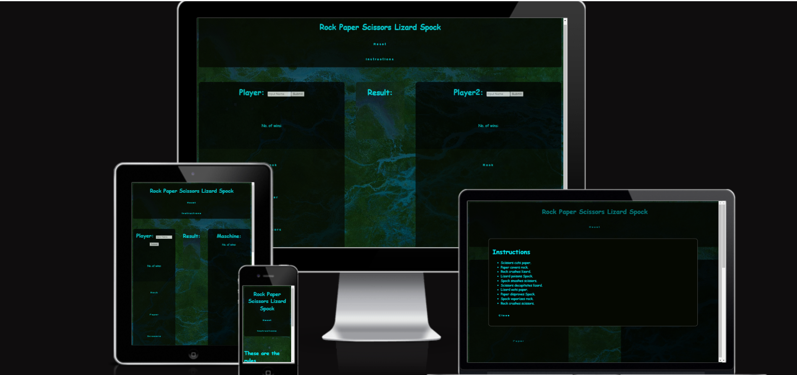

# Rock Paper Spock

This site has been designed to target a younger audience during those in-between study times when they need to burn off some steam. It is a variant of the popular Rock-Paper-Scissors game with a twist that youngsters of all ages can enjoy. 

The user faces off against the maschine in this game of chance, and everything is simple and easy to navigate and understand. The colors chosen were intended to be relaxing and communicate low pressure. Just a fun way to cool off the brain for a few minutes.

## Features

### Existing Features

- Landing menu
    - Displays game mode choices.
    - Displays game rules.

- Player vs. Player
    - Allows personalization.
    - Allows users to face off against each other.

- Player vs. Machine
    - The player can face off against the computer. 
    - The functionality is intuitive.

- Instructions Modal
    - Displays game rules on command using the instructions button.

- Scoreboard
    - Users can keep track of their scores. 

## Testing

### Test Case 1: Navigation

- The page was opened in the Google, Microsoft Edge and Google for Android browsers and the site navigation was tested. 
- The single player mode button toggles the landing page with single player view.
- The multi-player mode button toggles the landing page with multi-player player view.
- The reset button returns user from both the single player and multi-player views to the landing page.
- The single player mode button toggles the landing page with single player view.
- Instructions modal butto functions in all three views.

### Test Case 2: Game Logic

- The page was opened in the Google, Microsoft Edge and Google for Android browsers and the game logic was tested.
- All button actions are accurate.
- Score count is accurate.
- Name personalization works in single and multiplayer views.
- Results box text content is accurate.

### Test Case 3: Look & Responsiveness
- The page was opened in the Google, Microsoft Edge and Google for Android browsers and the game logic was tested.
- Section hover effect functions.
- Sections display responsively on the following screen sizes:
    * Mobile S - 320px
    * Mobile M - 375px
    * Mobile L - 425px
    * Tablet - 768px
    * Laptop - 1024px
    * Laptop - 1440px
    * Laptop - 2560px 

### Lighthouse Test

### Validator Testing
- No errors were returned when run through the W3C Validator
- No errors were returned when run through the Jigsaw Validator
- No errors were returned when run through JSHint

### Version Control
* The site was created using the Gitpod and pushed to github to the remote repository **‘Rock-Paper-Spock’**.
* The following git commands were used throughout development to push code to the remote repo:
* `git add .` - This command was used to add the files to the staging area before they are committed.
* `git commit -m "commit message"` This command was used to commit changes to the local repository queue ready for the final step.
* `git push` This command was used to push all committed code to the remote repository on github.

### Deployment to GitHub Pages 
 The following steps were used to deploy the website using GitHub Pages:

* In the GitHub repository, navigate to the 'Settings' tab.
* On the left hand menu select 'Pages'.
* For the source section, select 'Branch: Main'.
* Click Save.
* A live link will be displayed in a green banner when published successfully. 
* After a few minutes, the website will be build and deployed.
* The live link can be found [here](https://rogerwdavis.github.io/rockpaperspock.github.io/)

### Forking the repository:
By forking the GitHub Repository we make a copy of the original repository by using the following steps...
* Go to the GitHub repository.
* Click on 'Fork' button in upper right hand corner.
* Select 'Create new fork' from the drop-down menu.

## Clone the Repository:
* Click on the code drop down button
* Click on HTTPS
* Copy the repository link to the clipboard
* Open your IDE of choice (git must be installed for the next steps)
* Type git clone copied-git-url into the IDE terminal
* The project will now of been cloned on your local machine for use.

## Credits

- [Youtube Tutorial](https://www.youtube.com/watch?v=n1_vHArDBRA) provided switch logic.
- [Thea at Codepen](https://codepen.io/HighFlyer/pen/WNXRZBv) provided neon hover effect.
- Google was used extensively for troubleshooting.
- [W3Schools](https://www.w3schools.com/) was used extensively for troubleshooting.
- [Stackoverflow](https://stackoverflow.com/) was used extensively for troubleshooting.

